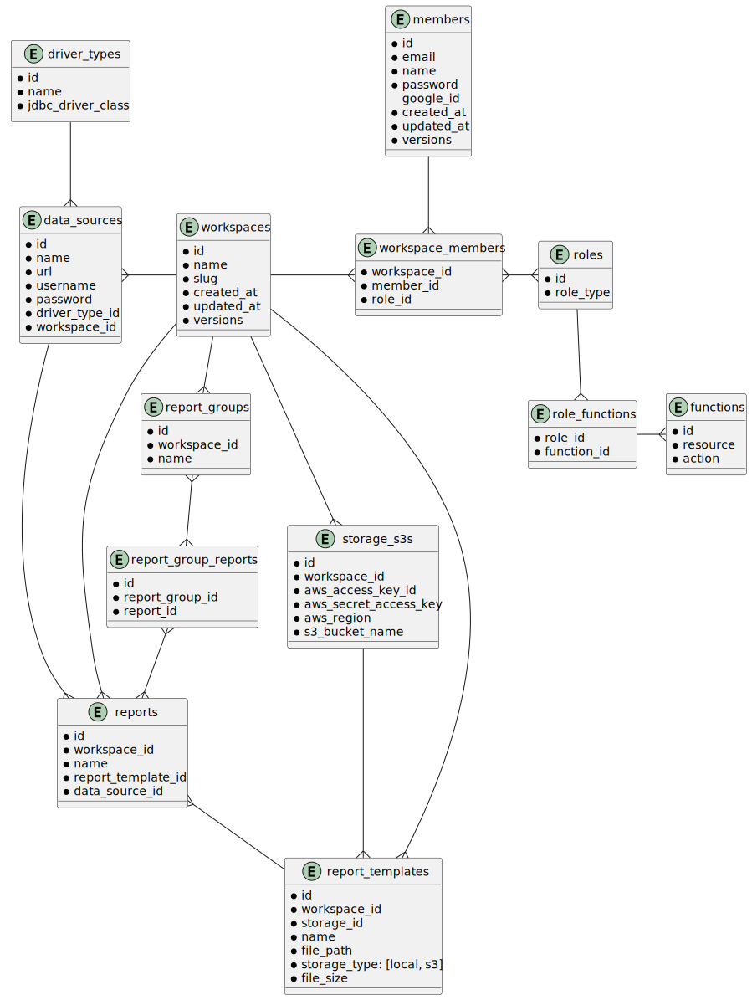

# OpenReports API
## Frameworks and libraries.

| Name         | Version | Usage        |
|--------------|---------|--------------|
| Scala        | 2.12.18 | -            |
| Scalatra     | 2.8.4   | All of them. |
| Servlet API  | 4.0.1   | Web API      |
| slf4j        | 2.0.7   | Logging      |
| logback      | 1.4.7   | Logging      |
| Flyway       | 9.22.3  | Migration    |
| Slick        | 3.5.1   | ORM          |
| PostgresSQL  | 42.6.0  | DB           |
| Google Guice | 7.0.0   | DI           |
| Scala Cache  | 0.28.0  | Cache        |
| sttp client  | 3.8.15  | HTTP Client  |
| jXls         | 2.12.0  | Reporting |

## Features (including not implemented yet)
- [ ] Output reporting.
- [ ] Output scheduled reporting.
- [ ] Supporting template format are xls, xlsx.
- [ ] Supporting output format are xls, xlsx, pdf.
- [ ] Manage users.
- [ ] Send report mail.

## How to set up

### Initialization

To run app in local machine, you need to install `Task`.

see below.

[Task](https://taskfile.dev/installation/)


```shell
brew install go-task
```

### Build image

```shell
task build
```

### Starting up

```shell
task up
```

### Migration

Basically, migration will execute automatically when docker-compose starts.
However, the below command makes you able to execute manually.

```shell
task migrateUp
```

### Drop all tables

```shell
task migrateClean
```

## Design

### ER diagram



### API list

- [x] public
  - [x] login
    - [x] with ID / password
    - [x] Google login
  - [x] health
  - [x] role
- [ ] private
  - [x] common
    - [x] logout
  - [x] members
    - [x] status (member info only)
    - [x] update (name, password)
    - [x] get permissions (including menus and workspace)
    - [x] generate access token
  - [x] reports
    - [x] list
    - [x] get
    - [x] create
    - [x] update
    - [x] delete
    - [x] output
  - [ ] report parameters
    - [ ] list
    - [ ] create
    - [ ] update
    - [ ] delete
  - [x] report groups
    - [x] list
    - [x] create
    - [x] update
    - [x] delete
  - [ ] scheduled reports
    - [ ] list
    - [ ] create
    - [ ] update
    - [ ] delete
  - [x] templates
    - [x] get
    - [x] list
    - [x] create
    - [x] update
    - [x] delete
  - [x] workspaces
    - [x] get
    - [x] list
    - [x] create
    - [x] update
    - [x] members
      - [x] get
      - [x] list
      - [x] create
      - [x] update
      - [x] delete
    - [x] data sources
      - [x] get
      - [x] list
      - [x] create
      - [x] update
      - [x] delete
    - [ ] Logs
      - [ ] list
      - [ ] delete

### TODO list
- [ ] make relation report and params
- [ ] make relation report and report-group
- [ ] make relation group and report-group
- [ ] add scheduling function
- [ ] add credit to layout.html
- [ ] execute on docker image
- [ ] modify to RESTful application such as SPA
- [ ] add validation for json value
